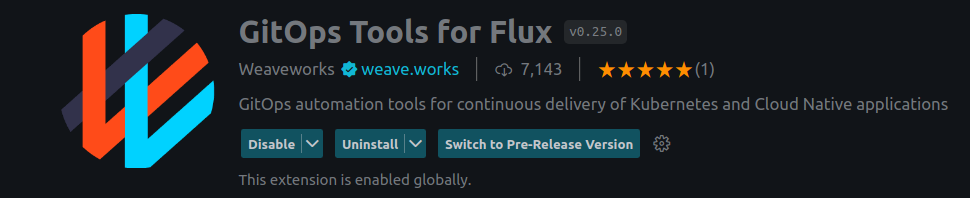

# Hello World Terraform Gitops

## Description

This is the hello world example for TF controller.
For the purposes of this example we will be using a [Kind](https://kind.sigs.k8s.io/) cluster

## Prerequisites


- Install kubectl
- Install flux cli

  ```bash
  curl -s https://fluxcd.io/install.sh | sudo bash
  ```

- Install the Weaveworks Gitops Vscode extension


- Install tf-controller 
  - Releases can be found [here](https://github.com/weaveworks/tf-controller/releases)
- Fork the git repository

- Create Kind cluster
  
  ```bash
  kind create cluster --name demo --config=kind/config.yaml
  ```

- Have a Github PAT Token

  You can read the docs [here](https://docs.github.com/en/authentication/keeping-your-account-and-data-secure/managing-your-personal-access-tokens)

- Install Flux on the Kind cluster Then follow the guide [here](https://fluxcd.io/flux/get-started/#install-flux-onto-your-cluster)

## Terraform Code Source

The code source in the example will contain basic terraform with no provider.
```json
terraform {
  required_version = ">= 0.12.26"
}

variable "subject" {
  type        = string
  default     = "World"
  description = "Subject to greet"
}

output "hello_world" {
  value = "Hello demo with source change, ${var.subject}!"
}
```

## Gitops

[Fluxcd](https://fluxcd.io/) has many types of sources defined and we will focus on `GitRepository` and `OCIRepository` here for the deployment of our terraform code.

### GitRepository

Assuming that you have a Flux-ready cluster running, you need to create a new repository that shall contain your deployment configuration.
In the new repository create the following 2 files.

#### helloworld-source.yaml
```yaml
---
apiVersion: source.toolkit.fluxcd.io/v1
kind: GitRepository
metadata:
  name: helloworld
  namespace: flux-system
spec:
  interval: 30s
  url: https://github.com/<GITHUB_USER>/helloworld-gitops # Forked Repository containing your terraform code
  ref:
    branch: main
```
#### helloworld-kustomization.yaml

```yaml
---
apiVersion: infra.contrib.fluxcd.io/v1alpha2
kind: Terraform
metadata:
  name: helloworld-tf
  namespace: flux-system
spec:
  path: ./
  interval: 1m
  sourceRef:
    kind: GitRepository
    name: helloworld
    namespace: flux-system
```
Commit and push your code to main 😨!
And that's it 😎, you will be able to check the out the output of the terraform code after reconciliation of the artefact.


### Oci Image generation

OCI images will be a great choice to bundle the source artefacts.
Usually the CI pipelines shall create the OCI image so that the configuration repository can use that build image referenced in the cluster.

#### Manage OCI images

The following commands will deploy, push and tag the image representing your terraform code.

```bash
export GITHUB_USER=<GITHUB_USER>
export GITHUB_TOKEN=<GITHUB_PAT_TOKEN>

flux push artifact oci://ghcr.io/$GITHUB_USER/helloworld:$(git rev-parse --short HEAD) \
	--path="./" \
	--source="$(git config --get remote.origin.url)" \
	--revision="$(git branch --show-current)/$(git rev-parse HEAD)"


 flux tag artifact oci://ghcr.io/$GITHUB_USER/helloworld:$(git rev-parse --short HEAD) \
  --tag latest
```

To allow flux to be able to read the images, you will need to create a secret in the Kind cluster.

```bash
export GITHUB_USER=<GITHUB_USER>
export GITHUB_TOKEN=<GITHUB_TOKEN>

flux create secret oci ghcr-auth \
  --url=ghcr.io \
  --username=$GITHUB_USER \
  --password=$GITHUB_TOKEN
```


#### helloworld-source.yaml
```yaml
---
apiVersion: source.toolkit.fluxcd.io/v1beta2
kind: OCIRepository
metadata:
  name: helloworld
  namespace: flux-system
spec:
  interval: 5m
  url: oci://ghcr.io/<GITHUB_USER>/helloworld
  ref:
    tag: latest
  provider: generic
  secretRef:
    name: ghcr-auth
```
#### helloworld-kustomization.yaml

```yaml
---
apiVersion: infra.contrib.fluxcd.io/v1alpha2
kind: Terraform
metadata:
  name: helloworld-tf
  namespace: flux-system
spec:
  path: ./
  interval: 1m
  approvePlan: auto
  sourceRef:
    kind: OCIRepository
    name: helloworld
    namespace: flux-system
  vars:
    - name: subject
      value: Bobi
  writeOutputsToSecret:
    name: helloworld-output
```
Commit and push your code to main 😨!
And that's it 😎, you will be able to check the out the output of the terraform code after reconciliation of the artefact.


### Reconcile Terraform Code

If you are impatient to see the results and I shall understand 🤓 you can reconcile the deployment with the following command.

```bash
tfctl reconcile -n flux-system helloworld-tf
```

### Read Terraform Output

```bash
kubectl get secret -n flux-system tfstate-default-helloworld-tf -o jsonpath="{.data.tfstate}" | base64 --decode | gzip -d
```
